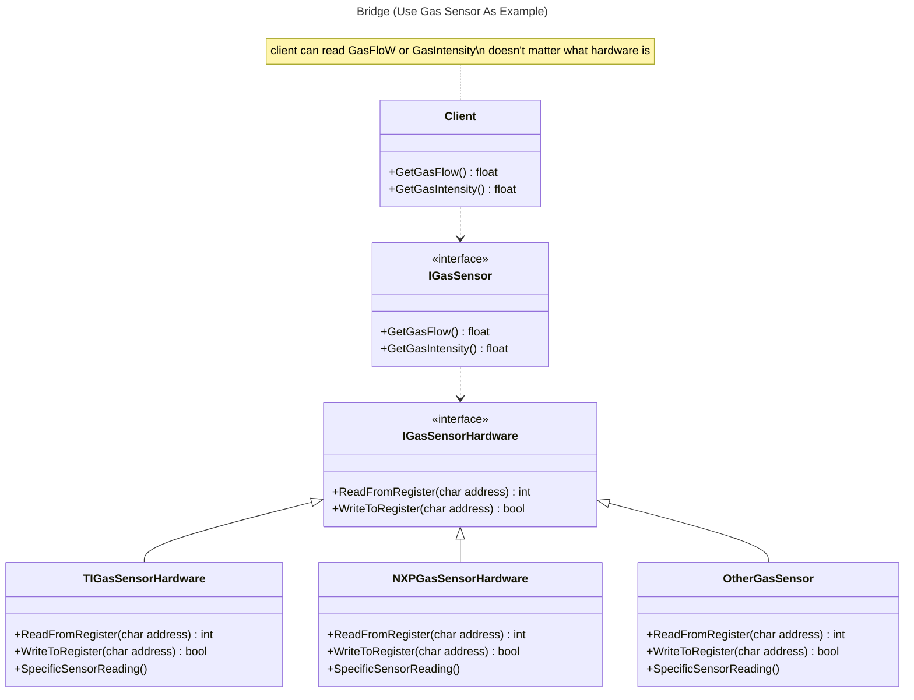

# Design Pattern In C++

## 🏛️ Builder

## 🌉 Bridge

Bridge is a structural design pattern that lets you split a large class or a set of closely related classes into two separate hierarchies—abstraction and implementation—which can be developed independently of each other. [[Ref](https://refactoring.guru/design-patterns/bridge)]


```cpp

  cout << "| Bridge Design Pattern |" << endl;

  IGasSensorHardware *gasSensorHardware = new NXPGasSensorHardware();
  IGasSensor *gasSensor = new NXPGasSensor(gasSensorHardware);

  cout << endl
       << "- gas Sensor Flow: " << endl << gasSensor->GetFlow();

  cout << endl
       << "- gas Sensor intensity: " << endl
       << gasSensor->GetIntensity();
```
