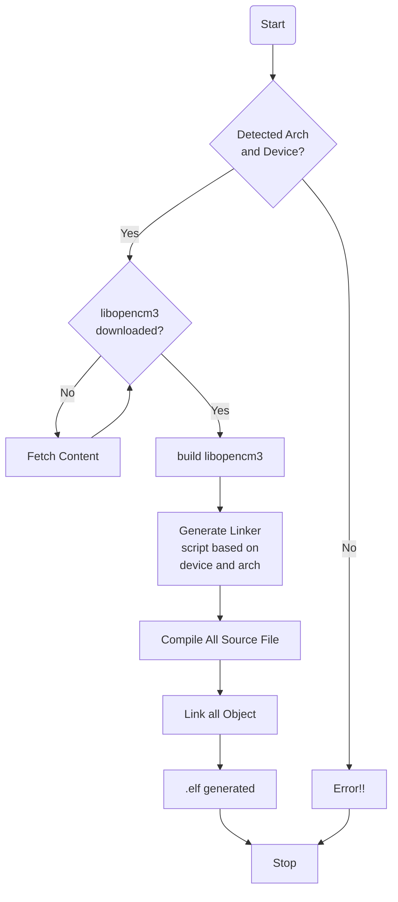

<p >
  <a href="">
    
  </a>
  <a href="">
    
  </a>
  <a href="">
    
  </a>
  <a href="https://github.com/ahsanu123/erpPlanner/blob/main/LICENSE">
    
  </a>
</p>

<h1 align="center"><a href="https://github.com/ahsanu123/learnRepo/tree/main/embedded">Libopencm3 CMake</a></h1>
<p align="center">  
   
</p>
<p align="center">cmake configuration for stm32 libopencm3, with automatic linker script generator</p>


## Introduction 

cmake configuration for stm32 libopencm3, with automatic linker script generator

## Build Step

Prerequisite:

- cmake 
- arm-none-eabi-gcc
- mkdocs (optional :material-ab-testing: ) 
- make (optional, if you build with gnu-make :material-ab-testing: ) 
- doxygen (optional, to build libopencm3 documentation :material-ab-testing:)


Almost all prerequisite available in `pacman`(arch linux), clone [this](https://github.com/ahsanu123/learnRepo/d) repo and change directory to this folder then...
```shell
git clone https://github.com/ahsanu123/learnRepo.git
cd embedded
cmake -S . -B build
cd build
make
```

you also can generate documentation by

```shell
cd build/_deps/libopencm3-src/doc
make
```

## Working Principle 

to use this script you only need to fill `arch` and `device `for your stm32 on main `CMakeLists.txt`, then let cmake do the job

```cmake
# ============================================
# THIS VALUE MUST BE SET BASED ON
# STM32 ARCHITECTURE AND
# DEVICE SERIES
# ============================================
set(auto_stm32_arch "f4")
set(auto_stm32_device "stm32f407vgt6")
# ============================================
```

then link your project 

```cmake
# ============================================
# CHANGE YOUR TARGET BASED ON YOUR PROJECT
# ============================================
project(blink VERSION 0.0.1 LANGUAGES CXX C ASM)

.....

add_executable(blink src/blink.cpp)
target_link_libraries(blink auto_stm32)

```

basic principle for this cmake script.


## Reference 

most of cmake configuration come from official libopencm3 documentation, cmake documentation and

- [github.com/plusk01/stm32-libopencm3-cmake-blink](https://github.com/plusk01/stm32-libopencm3-cmake-blink): Copied Basic Structure

- [github.com/libopencm3/libopencm3/blob/master/mk/genlink-config.mk](https://github.com/libopencm3/libopencm3/blob/master/mk/genlink-config.mk) : converting this configuration makefiles to cmake function


<sub><sup> Sunday 04:28 2024 in the morning, Made with ♥️ by AH...</sup></sub>
