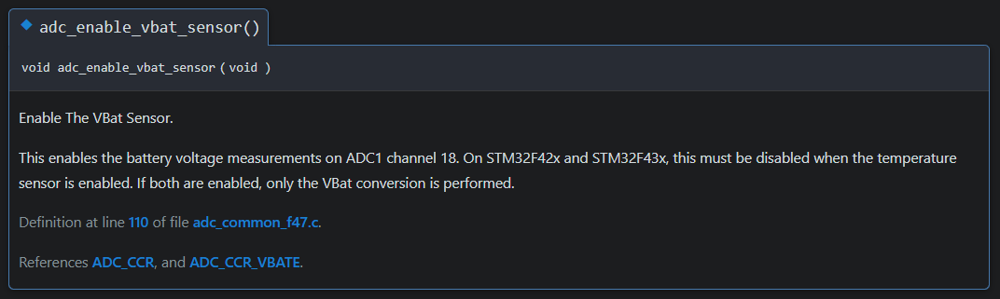

<p >
  <a href="">
    
  </a>
  <a href="">
    
  </a>
  <a href="">
    
  </a>
  <a href="https://github.com/ahsanu123/erpPlanner/blob/main/LICENSE">
    
  </a>
</p>

<h1 align="center">Libopencm3 CMake</h1>
<p align="center">  
   
</p>
<p align="center">cmake configuration for stm32 libopencm3, with automatic linker script generator</p>


# Introduction 

cmake configuration for stm32 libopencm3, with automatic linker script generator

### Build Step
clone this repo and change directory to this folder then...
```shell
cmake -S . -B build
cd build
make
```

you also can generate documentation by

```shell
cd build/_deps/libopencm3-src/doc
make
```

## Reference 

most of cmake configuration come from official libopencm3 documentation, cmake documentation and
- https://github.com/plusk01/stm32-libopencm3-cmake-blink : copied basic structure
- https://github.com/libopencm3/libopencm3/blob/master/mk/genlink-config.mk : converting this configuration makefiles to cmake function


<sub><sup> Sunday 04:28 2024 in the morning, Made with ♥️ by AH...</sup></sub>
