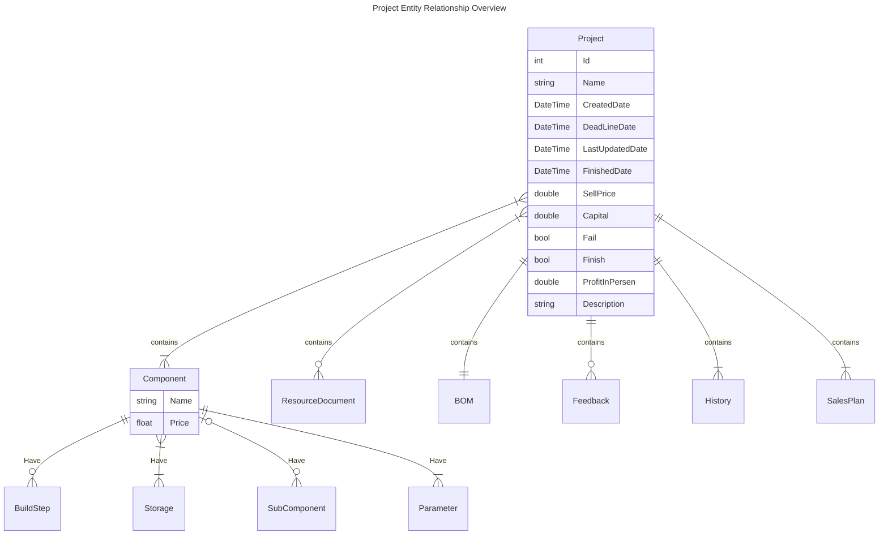

# Entity Diagram Overview

```mermaid
---
title: Project Entity Relationship Overview
---
erDiagram
    Project }|--|{ Component : contains
    Project }|--o{ ResourceDocument : contains
    Project ||--|| BOM : contains
    Project ||--o{ Feedback : contains
    Project ||--|{ History : contains
    Project ||--|{ SalesPlan : contains
    Component ||--o{ BuildStep: Have
    Component }|--|{ Storage: Have
    Component |o--o{ SubComponent : Have
    Component ||--|{ Parameter : Have
    Project{
        int Id 
        string Name 
        DateTime CreatedDate 
        DateTime DeadLineDate 
        DateTime LastUpdatedDate 
        DateTime FinishedDate 
        double SellPrice 
        double Capital 
        bool Fail 
        bool Finish 
        double ProfitInPersen 
        string Description 
    }

    Component {
        string Name
        float Price 
    }


```

